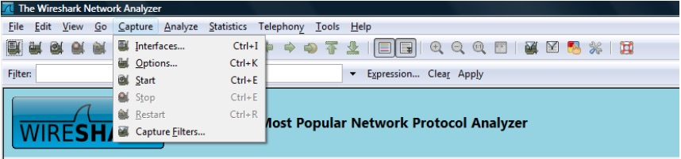
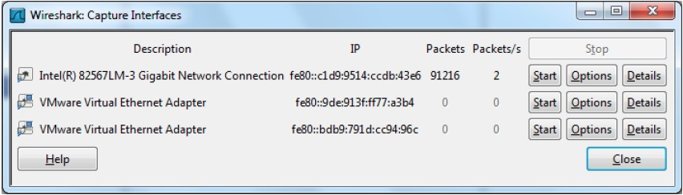
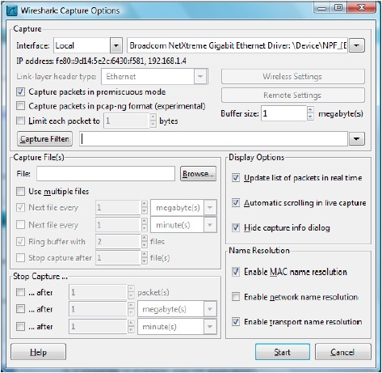
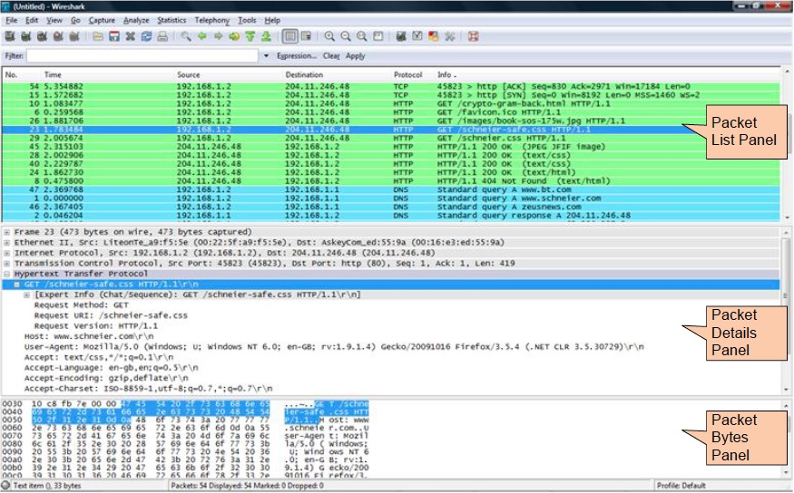

# Tutorial Menggunakan Wireshark
Pada bagian kedua ini, saya ingin melakukan dokumentasi beberapa fungsi penggunaan wireshark untuk melakukan sniffing, baik pada jaringan kabel maupun nirkabel.

## Melakukan Sniffing
Apabila sudah selesai menginstall wireshark, kita dapat langsung melakukan sniffing terhadap paket data yang kita capture dari wireshark. Cara capture data pakai wireshark tau semua kan? hehehe. Untuk melakukan sniffing, pastikan komputer yang akan digunakan sudah terhubung dengan jaringan yang akan di-sniff. 
Carane piye om? Berikut ini merupakan langkah-langkah untuk melakukan sniffing dengan wireshark.

1. Jalankan wireshark

2. Klik menu capture dan pilih Interface seperti yang terlihat pada gambar berikut.

Gambar 2.1 - Menu Capture Wireshark

3. Setelah menu interface di klik, maka akan ada kotak dialog wireshark seperti pada gambar 2.2 dibawah ini :

Gambar 2.2 - Interface Aktif

4. Kotak dialog pada gambar 2.2 diperoleh dari daftar antarmuka jaringan yang dimiliki. Kolom paket akan bernilai suatu bilangan tertentu, hal tersebut menunjukkan adanya paket data yang masuk

5. Pilih interface yang mempunyai paket jaringan yang masuk atau aktif

6. Selain itu, kita juga dapat melakukan konfigurasi dengan mengklik tombol options pada kotak dialog wireshark: Capture Interfaces

7. Setelah mengklik tombol options, maka akan tampil seperti gambar 2.3 berikut ini :

Gambar 2.3 - Capture Options

8. Pastikan pada menu capture options tersebut, bagian "Capture packets in promiscuous mode" sudah tercentang.

9. Kita juga dapat menentukan file dan lokasinya dengan klik tombol browse pada bagian Capture File.

10. Klik Start

11. Wireshark akan melakukan sniffing sesuai dengan konfigurasi yang dilakukan

12. Proses pengambilan paket data ini akan berlangsung secara real time

13. Semakin lama melakukan sniffing, semakin besar file yang akan dihasilkan

14. Contoh proses sniffing pada wireshark secara real time seperti pada gambar 2.4 berikut ini :

Gambar 2.4 - Sniffing Dengan Wireshark

15. Untuk menghentikan proses sniffing, klik icon adapter jaringan yang berwarna merah, letaknya nomor empat dari kiri.

16. Untuk menyimpan paket data yang sudah dicapture secara real time, klik menu File->Save As 

17. Tulis nama file nya, kemudian klik tombol save untuk menyimpan file hasil capture. File nya seharusnya berekstensi .pcap

## Hak Akses Sniffing
Pada beberapa kasus sniffing dengan sistem operasi kadang dibatasi. Oleh karena itu, untuk melakukan sniffing dengan wireshark alangkah baiknya dijalankan dengan memperoleh permission level tertinggi (root) atau administrator. Apabila pada linux cukup dengan memanggil perintah berikut :

`sudowireshark`

Sementara pada OS windows, dapat melakukan dengan cara klik kanan program wireshark kemudian pilih "run as administrator"

## Tugas Praktikum

1. Setelah dapat menggunakan wireshark dan paham tentang fungsi-fungsi dasar wireshark, silakan Anda capture paket data kemudian simpan dalam bentuk file .pcap , masing-masing paket data harus berbeda dari punya temennya. 
2. Buatlah laporan dokumentasi dari hasil paket data yang disimpan tersebut, dan berikan keterangan apa yang dapat Anda pahami dari paket data itu.
