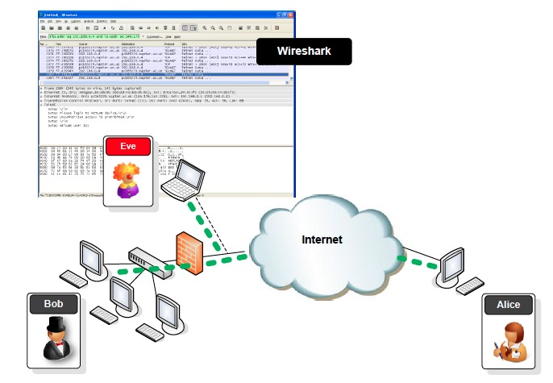

# Sniffing Pada Jaringan Kabel dan Nirkabel

Untuk melakukan sniffing dalam waktu yang lama, penggunaan gui wireshark tidak direkomendasikan karena terlalu banyak penggunaan sumber daya. Sebagai penggantinya, Anda dapat menggunakan software tshark dan dumpcap. Apabila Anda menggunakan linux seperti backtrack atau kali linux, software tersebut sudah tersedia, jadi tidak perlu melakukan instalasi.


# Melakukan Sniffing Pada Jaringan Kabel


## Teknik Tapping
Merupakan teknik yang digunakan untuk melakukan sniffing secara efektif sehingga data atau informasi paket data yang diperoleh hanya sesuai dengan yang diinginkan. Tentunya dengan teknik tapping ini akan meminimalisir paket data yang luas dan banyak.
Berikut ini terdapat ilustrasi jaringan komputer sederhana :


Gambar 3.1 - Skenario Sniffing

Pada gambar 3.1 terlihat bahwa ada tiga orang pengguna yaitu bob, alice dan eve. Skenario jaringan yang terdapat pada gambar 3.1 merupakan gambaran bob dan alice yang sedang berkomunikasi melalui jaringan internet. Eve merupakan pihak ketiga yang tidak diketahui oleh bob maupun alice. Eve melakukan sniffing ke NIC milik bob, sehingga paket data yang dikirim oleh bob dapat terbaca oleh eve menggunakan wireshark.

Berdasarkan gambar tersebut, maka penempatan mesin yang nantinya akan di-sniffing merupakan permasalahan utama, karena mesin yang akan di-sniffing harus mempunyai paket data masuk dan keluar agar dapat dipastikan nantinya memperoleh data yang dapat dianalisa.


## Tapping Pada Hub
Melakukan tapping pada hub merupakan langkah yang tepat karena jikalau kita memasang peralatan komputer pada suatu hub, kita akan memperoleh seluruh informasi dari jaringan yang ada. Hal ini dikarenakan sifat dari hub tersebut. Saat ini hub sudah jarang sekali dijual karena memiliki beberapa keterbatasan, terutama sering terjadinya kegagalan paket akibat tabrakan (collision). Apabila anda mendapati terdapat hub, maka hub adalah peralatan yang mudah sekali untuk di-sniffing.


## Tapping Pada Switch
Sebagai pengganti dari hub adalah switch. Switch menyediakan fitur yang lebih baik dibandingkan dengan hub. Komunikasi yang disediakan sudah full duplex, artinya proses pengiriman dan penerimaan data bisa terjadi secara bersamaan. Apabila Anda ingin melakukan tapping pada switch, anda harus mendapatkan transmisi paket yang mengarah ke mesin/komputer kita. Inilah kejelekan melakukan sniffing melalui sebuah switch. Agar dapat menjangkau ke jaringan yang lebih luas, biasanya kita dapat melakukan proses seperti : 
1. Port Mirroring
2. Hubbing Out
3. ARP Cache Poisoning


## Tapping Pada Router
Router merupakan peralatan yang dapat menghubungkan jaringan LAN yang satu dengan yang lainnya. Tapping pada router sebenarnya akan mengalami hal yang sama seperti pada switch. Pada sebuah kasus, misalnya untuk debugging network, router dapat dikonfigurasi sedemikian rupa hingga paket dapat diawasi. Hal yang sulit adalah ketika ada banyak router yang bekerja. Kadang kita dapat menangkap paket yang masuk, tetapi kadang tidak memperoleh informasi respons nya.


# Melakukan Sniffing Pada Jaringan Nirkabel
Melakukan sniffing pada jaringan nirkabel memang kadang mengalami kendala. Hal ini biasanya terkait dengan masalah driver dan sistem operasi yang memproteksinya.

## Problematika di Sistem Operasi Windows
Pada sistem operasi windows, aplikasi wireshark tidak dapat mendeteksi driver Wireless karena library Winpcap tidak dapat mendeteksinya. Sekalipun bisa, driver ini dikenal dengan nama microsoft. Kalau dijalankan, nantinya hanya memperoleh paket diatas protokol WLAN (802.11). Paket radiotap dan IEEE 802.11 tidak terdeteksi dengan baik. Alternatif lain, dapat menggunakan tools dari microsoft yang bernama Microsoft Network Monitor


## Problematika di Sistem Operasi Linux Ubuntu
Secara default, adapter Wifi pada linux, terutama Ubuntu, bekerja pada mode normal, artinya tidak pada kondisi monitor. Oleh karena itu, harus diaktifkan terlebih dahulu dengan sintak sebagai berikut:

```sudo ifconfig wlan0 down```

```sudo iwconfig wlan0 mode monitor```

Nilai wlan0 adalah nama adapter Wifi yang dimiliki. Sebelum melakukan ini, pastikan Wifi tidak terhubung dengan access point Wifi tertentu. Kadang ketika melakukan eksekusi, kita mengalami error. Hal ini mungkin karena perangkat keras adapter Wifi yang dimiliki atau drivernya tidak mendukung. Jika berhasil, lakukan pengujian seperti berikut :

```iwconfig wlan0```

Apabila berhasil, kita akan memperoleh respons. Disini terlihat bahwa mode wlan0 adalah Monitor. Artinya, kita dapat melakukan pengawasan protokol IEEE 802.11.


## Tugas Praktikum
Silakan Anda melakukan sniffing terhadap alamat IP Address di PC milik temennya yang terdapat pada laboratorium. Simpanlah hasil sniffing tersebut, kemudian lakukan analisa apa saja data-data "unik" yang Anda temukan di paket data tersebut.
