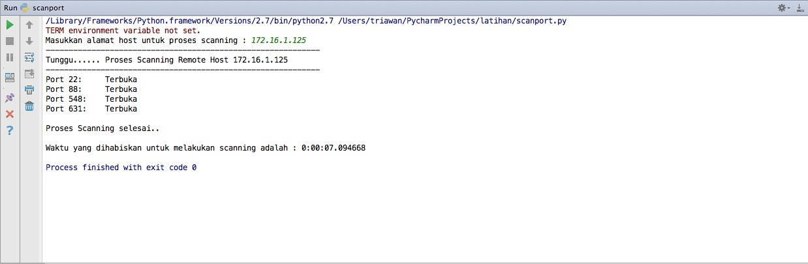
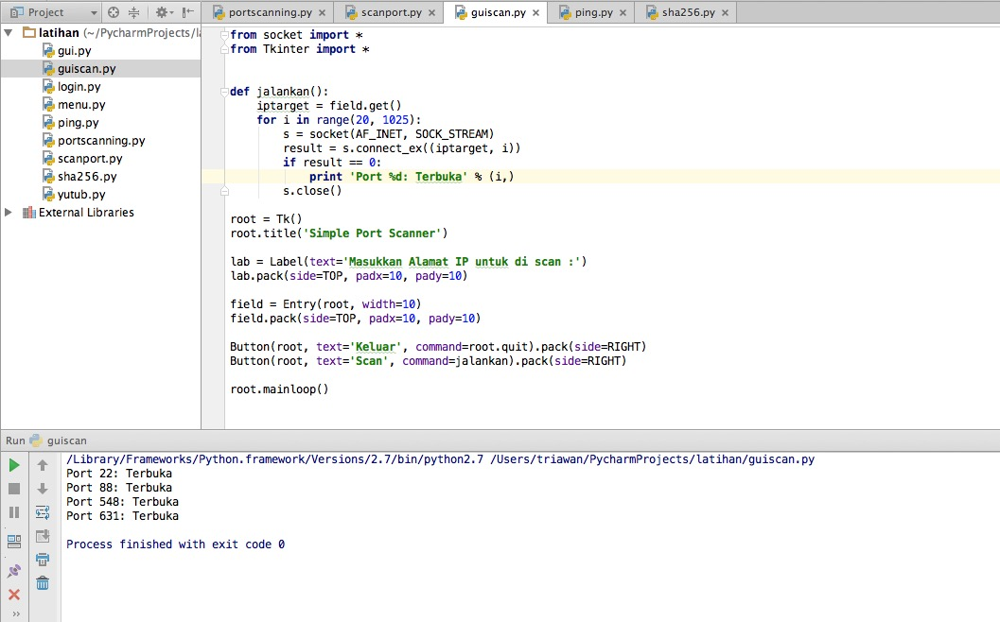

# Bab 5 Ping dan Port Scanning


## 5.1  Ping


Ping adalah salah satu mekanisme yang digunakan untuk mengetahui apakah suatu host dengan ip tertentu dapat diakses atau sedang aktif pada jaringan tertentu. Ping dikirimkan menggunakan protokol ICMP (Internet Control Message Protocol). Alamat IP yang merespon permintaan dari Ping tadi akan memberikan dua informasi yang berharga yaitu :
1. Apabila alamat ip tujuan merespon, kita jadi tau bahwa mesin/host dengan alamat ip tersebut adalah aktif dan responsif
2. Ping umumnya akan memberikan keterangan seberapa lama konektifitas antara pengguna yang mengirimkan ping kepada tujuan. Hal ini dapat dilihat dari catatan waktu yang ada pada saat pengguna mengirimkan paket ping.

Pada praktikum kali ini, saya ingin mengembangkan aplikasi yang bertujuan untuk melakukan ping terhadap IP Address tertentu untuk melakukan scanning terhadap jaringan lokal agar mengetahui eksistensi dari alamat IP yang tersedia/aktif.
Saya menggunakan library wxPython untuk membangun aplikasi berbasis GUI (Graphical User Interface). Untuk penggunaan Ping, Anda dapat menggunakan library yang ada, dinamakan Python-Ping. Library Python-Ping merupakan modul yang menangani operasi detail dari request ICMP.

Berikut ini merupakan kode program ```ping.py```
```
import wxversion
import wx 
import sys 
import ping 
import socket 

from time import gmtime, strftime
def pingScan(event):
    if hostEnd.GetValue() < hostStart.GetValue():
    dlg = wx.MessageDialog(mainWin,"Invalid Local Host Selection","Confirm", wx.OK | wx.ICON_EXCLAMATION)
    result = dlg.ShowModal()
    dlg.Destroy()
    return

mainWin.StatusBar.SetStatusText('Executing Ping Sweep .... Please Wait')

utcStart = gmtime()
utc = strftime("%a, %d %b %Y %X +0000", utcStart)
results.AppendText("\n\nPing Sweep Started: "+ utc+ "\n\n")

baseIP = str(ipaRange.GetValue())+'.'+str(ipbRange.GetValue())+'.'+str(ipcRange.GetValue())+'.'

ipRange = []

for i in range(hostStart.GetValue(), (hostEnd.GetValue()+1)):
    ipRange.append(baseIP+str(i))

for ipAddress in ipRange:
    try:
        mainWin.StatusBar.SetStatusText('Pinging IP:'+ ipAddress)
        delay = ping.do_one(ipAddress, timeout=2)
        results.AppendText(ipAddress+'\t')
        if delay != None:
            results.AppendText('Response Success')
            results.AppendText('Response Time:'+str(delay)+'Seconds')
            results.AppendText("\n")
        else :
            results.AppendText('Response Timeout')
            results.AppendText("\n")
    except socket.error, e:
        results.AppendText(ipAddress)
        results.AppendText('Response Failed:')
        results.AppendText(e.message)
        results.AppendText("\n")

utcEnd = gmtime()
utc = strftime("%a, %d %b %Y %X +0000", utcEnd)
results.AppendText("\nPing Sweep Ended: "+ utc + "\n\n")

mainWin.StatusBar.SetStatusText('')
    return

def programExit(event):
    sys.exit()

app = wx.App()

mainWin = wx.Frame(None, title="Simple Ping (ICMP) Sweeper 1.0", size = (1000,600))

panelAction = wx.Panel(mainWin)

scanButton = wx.Button(panelAction, label='Scan')
scanButton.Bind(wx.EVT_BUTTON, pingScan)

exitButton = wx.Button(panelAction, label='Exit')
exitButton.Bind(wx.EVT_BUTTON, programExit)

Results = wx.TextCtrl(panelAction, style = wx.TE_MULTILINE | wx.HSCROLL)

ipaRange = wx.SpinCtrl(panelAction, -1,'')
ipaRange.SetRange(0, 255)
ipaRange.SetValue(127)

ipbRange = wx.SpinCtrl(panelAction, -1,'')
ipbRange.SetRange(0, 255)
ipbRange.SetValue(0)

ipcRange = wx.SpinCtrl(panelAction, -1,'')
ipcRange.SetRange(0, 255)
ipcRange.SetValue(0)

ipLabel = wx.StaticText(panelAction, label = "IP Base: ")

hostStart = wx.SpinCtrl(panelAction, -1,'')
hostStart.SetRange(0, 255)
hostStart.SetValue(1)

hostEnd = wx.SpinCtrl(panelAction, -1,'')
hostEnd.SetRange(0, 255)
hostEnd.SetValue(10)

HostStartLabel = wx.StaticText(panelAction, label = "Host Start: ")
HostEndLabel = wx.StaticText(panelAction, label = "Host End: ")

actionBox = wx.BoxSizer()
actionBox.Add(scanButton, proportion=1, flag=wx.LEFT, border=5)
actionBox.Add(exitButton, proportion=0, flag=wx.LEFT, border=5)
actionBox.Add(ipLabel, proportion=0, flag=wx.LEFT, border=5)
actionBox.Add(ipaRange, proportion=0, flag=wx.LEFT, border=5)
actionBox.Add(ipbRange, proportion=0, flag=wx.LEFT, border=5)
actionBox.Add(ipcRange, proportion=0, flag=wx.LEFT, border=5)
actionBox.Add(HostStartLabel, proportion=0, flag=wx.LEFT|wx.CENTER, border=5)
actionBox.Add(hostStart, proportion=0, flag=wx.LEFT, border=5)
actionBox.Add(HostEndLabel, proportion=0, flag=wx.LEFT|wx.CENTER, border=5)
actionBox.Add(hostEnd, proportion=0, flag=wx.LEFT, border=5)

vertBox = wx.BoxSizer(wx.VERTICAL)
vertBox.Add(actionBox,proportion=0,flag=wx.EXPAND|wx.ALL, border=5)
vertBox.Add(results, proportion=1, flag=wx.EXPAND | wx.LEFT | wx.BOTTOM | wx.RIGHT, border=5)

panelAction.SetSizer(vertBox)

mainWin.Show()

app.MainLoop()
    ```

Tugas Praktikum

1. Berdasarkan kode program yang sudah dibuat, silakan Anda pakai kode program tersebut untuk melakukan ping terhadap jaringan diluar kampus. Studi kasusnya boleh dimana saja kecuali di wilayah kampus unmuh jember tidak diperbolehkan karena sudah diujicoba di praktikumnya.
2. Berikan screenshot dan disertai penjelasan yang baik dan kata-kata yang mudah dimengerti, kemudian buatlah laporan dalam bentuk PDF, dikumpulkan pada pertemuan minggu depan.
 


## 5.2  Port Scanning

Port Scanning merupakan cara yang digunakan untuk memeriksa port pada suatu host, apakah port yang terbuka adalah port yang memang digunakan atau port yang tidak diketahui kegunaannya.

Beberapa port yang sudah dikenal dan sering digunakan yaitu :


Tabel 5.1   List Nomor Port dan Nama Protocol

| Nomor Port | Protocol | 
| -- | -- | 
| 21 | FTP (File Transfer Protocol) | 
| 22 | SSH (Secure Shell) |
| 23 | Telnet | 
| 25 | SMTP (Simple Mail Transfer Protocol |
| 53 | DNS (Domain Name System) | 
| 80 | HTTP (Hypertext Transfer Protocol |
| 110 | POP3 (Post Office Protocol) |
| 119 | NNTP (Network News Transfer Protocol) |
| 143 | IMAP (Internet Message Access Protocol) |
| 161 | SNMP (Simple Network Management Protocol) 
| 194 | IRC (Internet Relay Chat) 
| 443 | HTTPS (HTTP Secure) 
| 465 | SMTPS (SMTP Secure) 
| 8443 | Router Remote Access |
|       |Dan lain sebagainya       |

Berikut ini terdapat kode program untuk melakukan port scanning berbasis command line:

Nama File : ```portscan.py```
```
import socket
import subprocess
import sys

from datetime import datetime

subprocess.call('clear', shell=True)

remoteServer = raw_input("Masukkan alamat host untuk proses scanning : ")
remoteServerIP = socket.gethostbyname(remoteServer)

print "-" * 60
print "Tunggu...... Proses Scanning Remote Host", remoteServerIP
print "-" * 60

t1 = datetime.now()

try:
    for port in range(1, 1025):
        sock = socket.socket(socket.AF_INET, socket.SOCK_STREAM)
        result = sock.connect_ex((remoteServerIP, port))
        if result == 0:
            print "Port {}: \t Terbuka".format(port)
        sock.close()

except KeyboardInterrupt:
    print "Anda tekan Ctrl+C"
    sys.exit()

except socket.gaierror:
    print "Hostname tidak dapat diperiksa. Program akan keluar. . . ."
    sys.exit()

except socket.error:
    print "Tidak dapat terhubung ke server"
    sys.exit()

t2 = datetime.now()
total = t2 - t1

print
print "Proses Scanning selesai.."
print
print "Waktu yang dihabiskan untuk melakukan scanning adalah :", total
```
Outputnya adalah sebagai berikut:


Gambar 5.1  Port Scanning Berbasis Command Line

Pada gambar 5.1 tersebut, terdapat keterangan port tertentu yang terbuka dari suatu alamat ip. Apabila port yang terbuka sudah dikenali, maka alamat ip tersebut tidak ada akses yang mencurigakan. Sedangkan apabila port yang terbuka tidak dikenali, maka silakan diperiksa dengan baik penggunaan akses datanya. 

Berikut ini terdapat kode program lainnya untuk melakukan port scanning berbasis GUI:

Nama File : ```guiportscan.py```
```
from socket import *
from Tkinter import *


def jalankan():
    iptarget = field.get()
    for i in range(20, 1025):
        s = socket(AF_INET, SOCK_STREAM)
        result = s.connect_ex((iptarget, i))
        if result == 0:
            print 'Port %d: Terbuka' % (i,)
        s.close()

root = Tk()
root.title('Simple Port Scanner')

lab = Label(text='Masukkan Alamat IP untuk di scan :')
lab.pack(side=TOP, padx=10, pady=10)

field = Entry(root, width=10)
field.pack(side=TOP, padx=10, pady=10)

Button(root, text='Keluar', command=root.quit).pack(side=RIGHT)
Button(root, text='Scan', command=jalankan).pack(side=RIGHT)

root.mainloop()

```

Output dari program diatas adalah:


Gambar 5.2 Port Scanning Berbasis GUI

Pada gambar 5.2, tampilan gui nya tidak tercapture. Tampilan gui hanya digunakan untuk memasukkan alamat ip yang akan diperiksa port nya mulai dari port 20 sampai 1025. Program ini sedikit berat dalam melakukan port scanning karena akan memeriksa port yang terbuka satu per satu, apabila jaringan maupun komputernya lambat, maka akan berpengaruh dengan waktu penyelesaian port scanning.


## Tugas Praktikum

Berdasarkan kode program port scanning tersebut. Masing-masing mahasiswa silakan mencoba melakukan port scanning terhadap alamat ip tertentu (bisa juga alamat ip komputer anda) sehingg