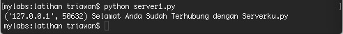
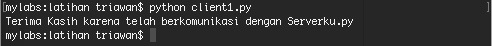
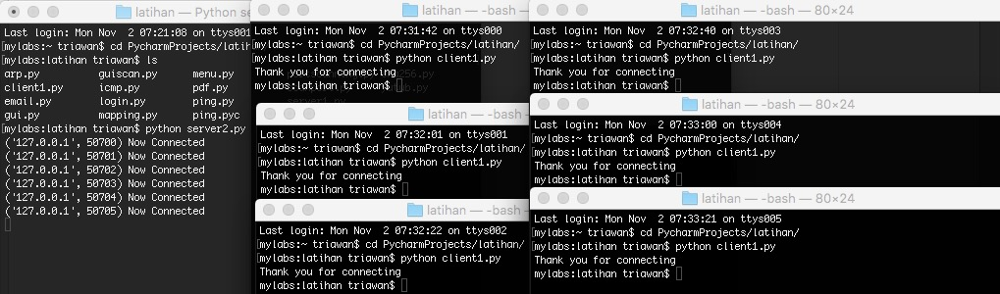

# Pengenalan Python

Python merupakan bahasa pemrograman yang populer khususnya pada bidang keamanan komputer. Pada modul ini, beberapa eksperimen dalam pembuatan program untuk mendukung proses keamanan komputer, ditulis menggunakan python versi 2. Apabila tidak ingin rumit, maka pakailah sistem operasi linux varian terbaru, misalnya : ubuntu, kali linux, dan lain sebagainya. Bahasa pemrograman python beserta modul-modulnya sudah terinstall otomatis di sistem operasi linux.


## Pengenalan Network Socket

Network socket merupakan alamat yang mengandung data alamat ip address dan nomor port. Singkatnya, socket merupakan cara yang mudah untuk berkomunikasi dengan komputer lain. Oleh karena itu, socket merupakan suatu proses yang dapat berkomunikasi dengan proses yang lain melalui jaringan.

Pada bahasa pemrograman python, untuk membuat socket menggunakan fungsi socket.socket() yang tersedia pada modul socket. Sintaks standar dari fungsi socket adalah:

```s = socket.socket(socket_family, socket_type, protocol=0)```

Deskripsi parameter dari fungsi socket diatas adalah sebagai berikut:

```socket_family: socket.AF_INET, PF_PACKET```

* AF_INET merupakan alamat untuk IPv4. 
* PF_PACKET merupakan device driver layer. Umumnya merupakan library pcap yang digunakan pada linux.


## Cara Kerja Method Socket Server 

Dalam konsep arsitektur client-server, terdapat dua layanan yang berbeda dari masing-masing perangkat. Server bertugas secara terpusat untuk memberikan service/layanan yang diminta oleh client. Sedangkan client bertugas untuk mengirimkan permintaan dan menerima layanan dari server.

Beberapa metode pada fungsi socket di python, yaitu:
* socket.bind(address): Method ini digunakan untuk menghubungkan alamat ip dengan nomor port ke socket. Socket harus dibuka dahulu sebelum terhubung dengan alamat tersebut.
* socket.listen(q): Method ini akan memulai fase mendengarkan koneksi TCP. Argumen q mendefinisikan jumlah koneksi maksimum yang dapat ditangani server.
* socket.accept(): Penggunaan method ini adalah untuk menerima koneksi yang dikirim dari client. Sebelum menggunakan method ini, method socket.bind(address) dan socket.listen(q) harus digunakan terlebih dahulu. Method socket.accept() akan mengembalikan dua nilai yaitu: client_socket dan address, dimana client_socket adalah objek socket baru yang digunakan untuk mengirim dan menerima data selama terhubung, dan address adalah alamat client.
 

## Method Socket Client

Method yang terdapat untuk fungsi di socket client adalah:

socket.connect(address): Method ini untuk menghubungkan client ke server. Argumen address adalah alamat servernya.


## Method Socket

Beberapa fungsi yang terdapat pada method socket adalah sebagai berikut:

* socket.recv(bufsize): Method ini menerima pesan TCP dari socket. Argumen bufsize mendefinisikan jumlah data maksimum yang dapat diterima dalam suatu waktu.
* socket.recvfrom(bufsize): Method ini menerima data dari socket. Method ini akan mengembalikan sepasang nilai, nilai pertama akan memberikan informasi penerimaan data, nilai kedua akan memberikan alamat socket untuk melakukan pengiriman data
* socket.recv_into(buffer): Method ini menerima data kurang dari atau sama dengan argumen buffer. Parameter buffer dibuat oleh method bytearray()
* socket.recvfrom_into(buffer): Method ini mempunyai data dari socket dan mengirimkan melalui buffer. Nilai kembalian adalah nbytes dan address, dimana nbytes adalah jumlah bytes yang diterima, dan address adalah alamat socket pada saat mengirim data.
* socket.send(bytes): Method ini digunakan untuk mengirimkan data ke socket. Sebelum mengirim data, pastikan bahwa socket sudah terhubung ke mesin. Method ini akan mengembalikan jumlah byte yang terkirim.
* socket.sendto(data, address): Method ini digunakan untuk mengirim data ke socket. Secara umum, method ini menggunakan UDP. UDP merupakan protocol yang bersifat connectionless (tidak memperdulikan apakah paket sudah terkirim atau belum yang penting sudah dikirimkan oleh si pengirim (server/client)).
* socket.sendall(data): Method ini akan mengirimkan semua data ke socket
 

Berikut ini terdapat kode program client server sederhana:

Nama file : ```serverku.py```

```
import socket

host = "192.168.0.1" 
port = 12345 
s = socket.socket(socket.AF_INET, socket.SOCK_STREAM)
s.bind((host,port)) 
s.listen(2)
conn, addr = s.accept()
print addr, "Selamat Anda Sudah Terhubung dengan Serverku.py"
conn.send("Terima Kasih karena telah berkomunikasi dengan Serverku.py")
conn.close()
```

Nama file : ```clientku.py```

```
import socket

s = socket.socket(socket.AF_INET, socket.SOCK_STREAM)
host = "192.168.0.1" 
port =12345 
s.connect((host,port))
print s.recv(1024)
s.send("Hai Serverku.py, Clientku.py ingin berkomunikasi")
s.close()
```

Output dari kode program diatas adalah: 


Gambar 6.1 Output Serverku.py


Gambar 6.2 Output Clientku.py

Metode konektivitas client server diatas hanya untuk menangani satu permintaan yang dikirim oleh client. Apabila menginginkan server socket menangani lebih dari satu service, maka tinggal tambahkan looping setelah statement listen. 

Berikut ini kode program lengkapnya :

Nama file : ```serverku2.py```

```
import socket

host = "0.0.0.0"
port = 12345
s = socket.socket(socket.AF_INET, socket.SOCK_STREAM)
s.bind((host, port))
s.listen(2)
while True:
    conn, addr = s.accept()
    print addr, "Now Connected"
    conn.send("Thank you for connecting")
    conn.close()

```
Output dari program diatas adalah sebagai berikut:


Gambar 6.3 Output serverku2.py dan clientku.py ketika dijalankan


## Tugas Praktikum

