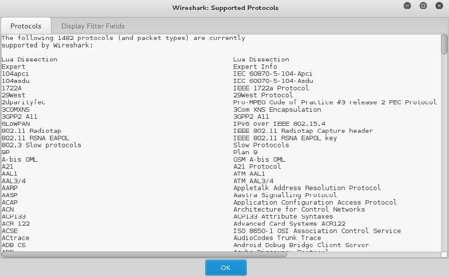
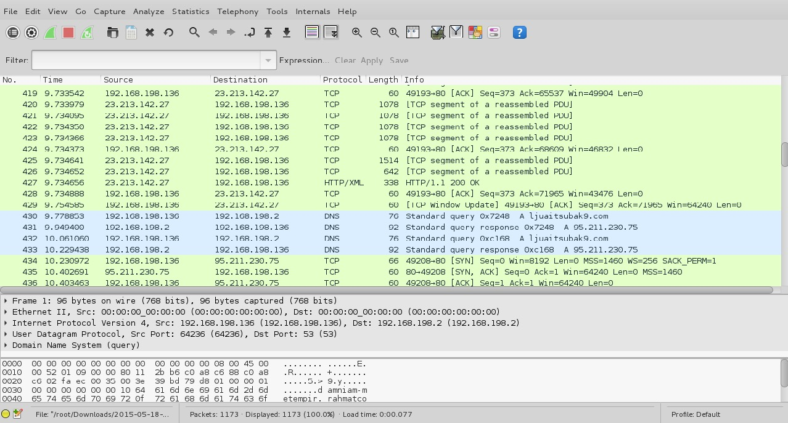

# Dasar-dasar Penggunaan Wireshark

Pada pertemuan pertama, saya ingin menjelaskan fungsi dari software / perangkat lunak Wireshark. Wireshark merupakan perangkat lunak yang spesifik untuk melakukan analisa paket data pada jaringan secara real time dan menampilkan hasil analisa paket data tersebut dalam format yang dipahami oleh pengguna. Wireshark dapat melakukan paket filtering, paket color coding, dan fitur-fitur lain yang dapat mengizinkan untuk melihat detail network traffic dan inspeksi paket data secara individu.

# Tools

Untuk mengunduh software wireshark, Anda dapat mengunjungi alamat website official wireshark di http://www.wireshark.org/download.html. Wireshark dapat digunakan pada sistem operasi Windows, Mac OS X, dan Linux.

# Kapan Menggunakan Wireshark

Ada banyak hal yang dilakukan menggunakan wireshark. Berikut ini merupakan contoh kasus yang mungkin dibutuhkan tools wireshark :
1. Melakukan troubleshoot permasalahan jaringan
2. Melakukan pengujian masalah keamanan
3. Melakukan debugging implementasi protokol
4. Belajar protokol jaringan

Wireshark ini dapat kita sebut sebagai tools yang powerfull, karena dengan menggunakan tools ini, kita bisa saja dapat menggunakannya untuk mencuri informasi yang sensitif pada jaringan, seperti password, cookie, dan lain sebagainya.

# Fitur

Wireshark mempunyai fitur yang lengkap, diantaranya adalah :

1. Multiplatform - Dapat digunakan untuk beberapa platform sistem operasi (Unix, Mac, Windows, dan Linux)
2. Dapat melakukan capture paket data jaringan secara real time
3. Dapat menampilkan informasi protokol jaringan dari paket data secara lengkap
4. Paket data dapat disimpan menjadi file dan nantinya dapat dibuka kembali untuk analisis lebih lanjut
5. Filtering paket data jaringan
6. Pencarian paket data dengan kriteria spesifik
7. Pewarnaan tampilan paket data untuk mempermudah analisa paket data
8. Menampilkan data statistik

Untuk melakukan capture paket data yang keluar ataupun masuk pada jaringan, wireshark memerlukan perangkat fisik NIC (Network Interface Card).

# Protokol

Wireshark dapat melakukan analisis terhadap beberapa protokol paket data jaringan. Sampai wireshark versi 1.12.6, sudah mendukung 1482 protokol, seperti terlihat pada gambar dibawah ini:

Gambar 1.1 Protokol Yang Disupport Wireshark

Pada gambar 1.1 diatas, wireshark sudah mendukung 1482 protokol, tentunya jumlah protokol yang didukung wireshark akan bertambah lagi pada tiap versinya.

# Pengawasan Data Secara Real Time

Wireshark dapat menganalisis paket data secara real time. Artinya, aplikasi wireshark akan mengawasi semua paket data yang keluar masuk melalui antarmuka yang telah ditentukan dan selanjutnya akan menampilkan hasil paket datanya. Contoh aplikasi wireshark yang sedang melakukan pengawasan dapat dilihat pada gambar 2, berikut ini:

Gambar 1.2 Tampilan Data Real Time Wireshark

Jika komputer kita terhubung dengan jaringan kecepatan tinggi dan pada komputer sedang dijalankan banyak aplikasi berbasis jaringan, aplikasi wireshark akan menampilkan banyak sekali paket data.

# Tugas Praktikum

Silakan Anda lakukan uji coba penggunaan Wireshark untuk melakukan capture paket data, kemudian kumpulkan hasilnya berupa dokumentasi gambar/screenshot dan disertai keterangannya.

